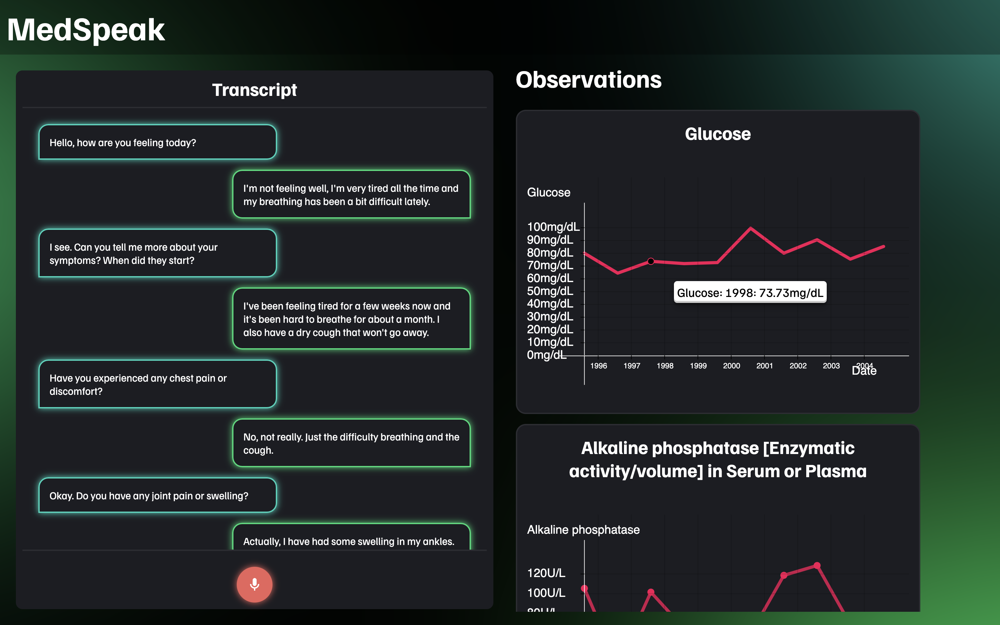

## MedSpeak

MedSpeak is a full stack Svelte + Flask web app that uses deep learning to streamline the patient-physician interaction by auto-parsing spoken conversations to extract key phrases and compute the most relevant fields of EHR data in real-time.




## Introduction

Our web application consists of two main functionalities: a **conversation visualizer** and a **ranked prompt list**. 

The conversation visualizer takes in a transcript of a recording of the interaction between the patient and physician. The speech bubbles indicate which speaker each message corresponds to. Behind this interface, the words are processed to determine what topics are currently being discussed. 

The ranked prompt list pulls the most relevant past information for the patient to the forefront of the list, making it easy for the physician to ask better clarifying questions or make adjustments to their mental model, all without having to click and scroll through tens or hundreds of records.


## Design

Our end goal is to help doctors efficiently filter and prioritize patient data, so each aspect of our process (ML, backend, frontend) attempts to address that in some way.

We designed a **deep-learning-based recommendation system** for features within the patient’s Electronic Health Records (EHR). It computes important features to be displayed based on the patient’s description of their medical needs and symptoms. We leveraged the **OpenAI Embedding API** to embed string token representations of these key features into a high dimensional vector space and extract semantic similarity between each. Then, we employed the _k_-nearest neighbor algorithm to compute and display the top _k_ relevant features. This allowed us to cluster related keywords together, such as "COVID" with "shortness of breath". The appearance of one word/phrase in the cluster will bring EHR data containing other related words/phrases to the top of the list. 

We implemented the ML backend using **Flask in Python**. The main structure and logic were done in **Node.js** within the **Svelte** framework. We designed the UI and front-end layout in Svelte to create something easy to navigate and use in time-sensitive situations. We designed the left panel to be the conversation visualizer, along with an option to record sound (see "What's next for MedSpeak"). The right panel holds the prompt list, which updates in real time as more information is fed in.

## Set Up and Run Instructions

- Install Requirements
```
pip install -r /backend-ml/requirements.txt
```
- Install node version greater than 16
- Run app according to directions under the 


